<div align="center">

# 실:온 (Sil:On)

### 치매 진단 전후, 재가 돌봄 정보·기록 플랫폼

*실로 잇는 따뜻한 기억*

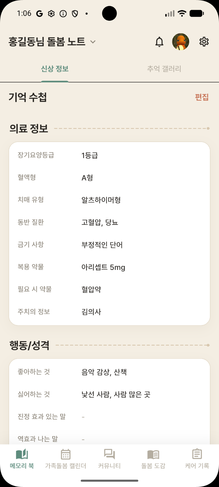
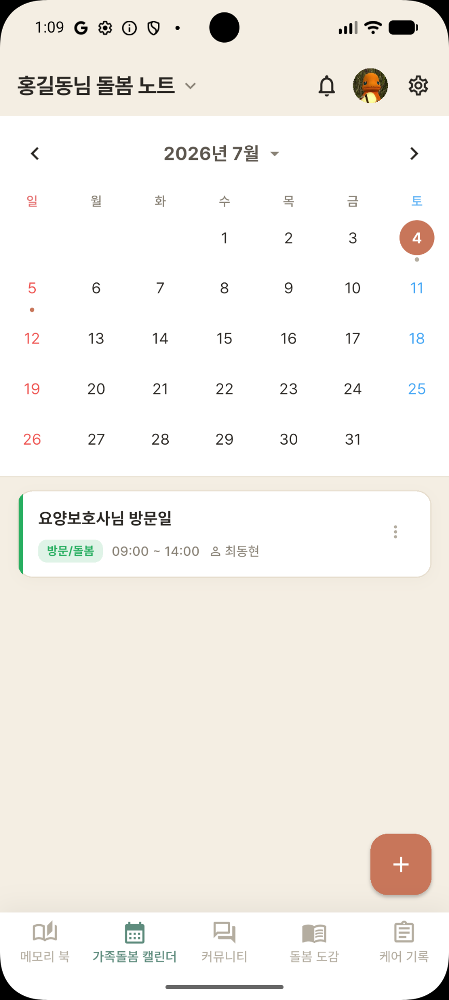
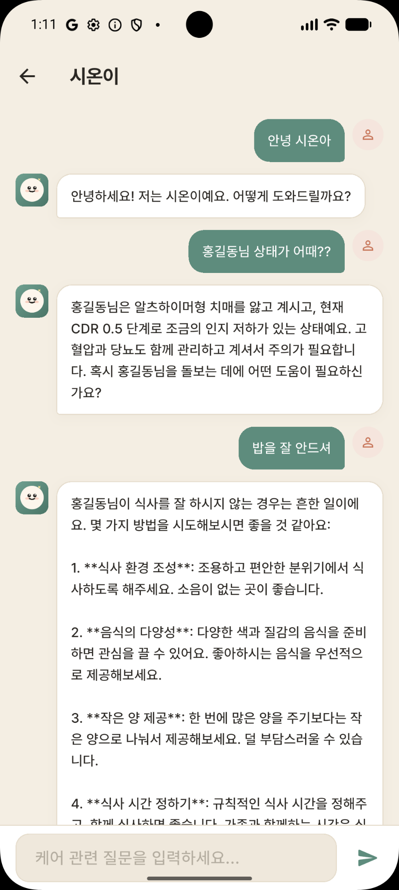


**2026 글로벌 피우다프로젝트** · 세부주제 (5) 치매 돌봄 및 가족지원 솔루션 · 팀 **피오리라**

[Frontend (Flutter)](https://github.com/kiddo-dong/Sil-On-Flutter-Front-) · [Backend (Spring Boot)](https://github.com/kiddo-dong/Sil-On-BackEnd)

</div>

---

## 📑 목차
1. [프로젝트 개요](#-프로젝트-개요)
2. [개발 배경](#-개발-배경)
3. [개발 목표](#-개발-목표)
4. [핵심 이용자](#-핵심-이용자)
5. [핵심 기능 5종](#-핵심-기능-5종)
6. [사용자 시나리오](#-사용자-시나리오)
7. [차별점](#-차별점)
8. [기술 스택](#-기술-스택)
9. [시스템 아키텍처](#-시스템-아키텍처)
10. [주요 설계 포인트](#-주요-설계-포인트)
11. [데이터베이스 스키마 (ERD)](#-데이터베이스-스키마-erd)
12. [API 개요](#-api-개요)
13. [프로젝트 구조](#-프로젝트-구조)
14. [로컬 실행 방법](#-로컬-실행-방법)
15. [기대 효과 & 사업화](#-기대-효과--사업화)
16. [진행 사항 & 추후 계획](#-진행-사항--추후-계획)
17. [팀 소개](#-팀-소개)
18. [참고 문헌](#-참고-문헌)

---

## 🩺 프로젝트 개요

**실:온**은 부모·배우자의 치매가 의심되거나 막 진단을 받은 **가족 보호자**가, 짧은 기간에 몰려오는 정보·일정·판단을 **하나의 구조 안에서** 관리하도록 돕는 재가 돌봄 정보·기록 플랫폼입니다.

> **환자를 중심에 둔 정보 관리 및 정보 제공 → 소통 → 다음 돌봄으로 이어지는 기록**

| 영역 | 기능 |
|------|------|
| 정보 · 일정 관리 | **메모리북**, **가족 돌봄 캘린더** |
| 소통 | **커뮤니티**, **돌봄도감 (AI 시온이)** |
| 기록 | **케어 기록** |

> ⚠️ 실:온은 치매를 **진단하지 않습니다.** 돌봄 정보와 기록을 돕는 서비스이며, 정확한 진단은 의료기관 방문을 권장합니다.

---

## 📊 개발 배경

### 01. 기획 동기 — 요양원 봉사활동에서 경험한 구조의 공백

요양 시설에는 체계적인 돌봄 구조가 있지만, 같은 환자가 **집으로 돌아가는 순간 그 구조는 사라집니다.**

| 항목 | 요양 시설 | 재가 요양 |
|------|-----------|-----------|
| 전문 돌봄 프로그램 (케어포 등) | ✅ 체계적인 관리 | ❌ 없음 <sub>(장기요양등급 판정 후 간병인 고용 시 '장기요양 제공 기록지'만 사용)</sub> |
| 간병인/기관 간 환자 상태·이슈 공유 | ✅ | ❌ 없음 |
| 치매(인지증) 전문 간병 프로그램 및 지식 | ✅ | ❌ 없음 |

### 02. 재가 돌봄의 현실

<table>
<tr><th>🇰🇷 한국</th><th>🇯🇵 일본 — 한국보다 약 10년 선행</th></tr>
<tr><td>

| 지표 | 수치 |
|------|------|
| 재가 돌봄 가족의 부담 호소 비율 | **45.8%** |
| 가족 직접 돌봄 평균 지속 기간 | **27.3개월** |

> *"그래서 그때 누군가가 와서 도움이 돼 줄 수 있는 시스템이 있으면 좋겠다는 생각이 들어요"*
> — 재가 돌봄 보호자 인터뷰

</td><td>

- 인지증 환자 **443만 명(2022) → 584만 명(2040)**
- **'노노케어'** 현상 심화, 재가 개호 수요 급팽창, 개호 인력 부족이 국가적 과제로 대두

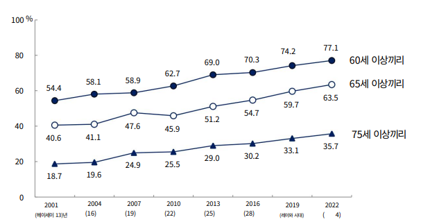
<br/><sub>후생노동성 「국민생활기초조사 2022」 — 동거 주 간병인의 연령 조합</sub>

</td></tr>
</table>

### 03. 소통창구의 역설 — "정보의 공유는 있어도, 판단의 지원은 없다"

보호자들은 네이버 카페 **"치노사모"**(회원 약 5만 명), 일본 **"안심 카이고"** 같은 커뮤니티에 모이지만,

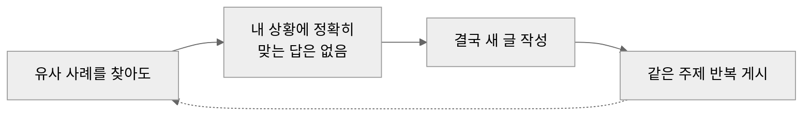

**치노사모 인지증 Q&A 게시판 10주 전수 분석** (2026.04.26 ~ 07.01, 게시글 150건)

| 반복 주제 | 건수 | 반복되는 이유 |
|-----------|------|---------------|
| 기저귀 관리 | 7건 | 제품 비교 · 정서적 거부 · 교체 주기 등 **세부 조건이 모두 다름** |
| 장기요양등급 신청 | 6~7건 | 신청 시점(입원 중 가능 여부) · 등급 변경 실익 등 **세부 조건이 모두 다름** |
| BPSD(행동심리증상) | 4건 | 환자마다 다른 증상·맥락 |

<details>
<summary>주제별 분포 전체 (150건) · 분석 방법론</summary>

| 주제 | 비율 |
|------|------|
| 약물·진단·병원 | 30.0% |
| 증상 감별 | 21.3% |
| 기타(생활) | 9.3% |
| 제도·비용 | 8.7% |
| 시설·주간보호 | 8.0% |
| 위생·간병 실무 | 8.0% |
| 행동심리증상 | 4.7% |
| 식사/영양 | 3.3% |
| 보호자 소진 | 2.7% |
| 의사소통 | 2.0% |
| 수면 | 2.0% |

- **1차 분류**: 작성자가 직접 부여한 말머리 — 61건(40.7%)
- **2차 분류**: 말머리 부재 시 제목 키워드 기반 추정 — 75건(50.0%)
- **미분류**: 제목만으로 판단이 어려운 경우 '기타' — 14건(9.3%)
- **한계**: 제목·말머리 기준의 예비적 분류로, 본문 전체 내용을 반영하지 못함

</details>

---

## 🎯 개발 목표

> **"인간중심돌봄 원칙 기반, 환자의 반응이 다음 돌봄으로 이어지는 구조"**

| 🌱 돌봄 판단의 자산화 | 🔍 정보 탐색 비용 축소 | 🤝 판단 고립 해소 |
|:---:|:---:|:---:|
| 판단을 시점 기록 데이터로 축적,<br/>다음 결정의 근거로 전환 | 흩어진 정보·일정을<br/>검증된 단일 구조로 통합 | 비전문 보호자 간<br/>신뢰 기반 소통 구조 구축 |

---

## 👥 핵심 이용자

> **부모 · 배우자의 치매가 의심되거나 막 진단을 받은 시점의 40~50대 가족 보호자**
> 평균 **47.4세** — 본업·가정을 유지하며 돌봄을 병행

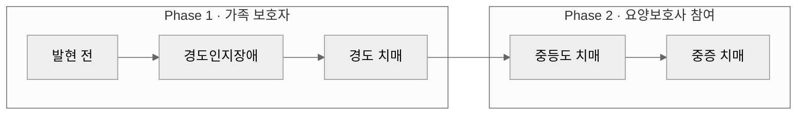

- 국내 치매 환자 중 **경도 단계 비율 67.7%** — 일상생활은 유지되나 **진단 직후 정보·행정 부담이 단기간 집중**되고, 이 시기의 대응이 이후 돌봄 전반에 영향을 미칩니다.
- 경도 단계에서는 전문 간병 인력 수요가 핵심 문제가 아니므로, 요양보호사 관련 기능은 **사전 설계하되 Phase 2로 분리**하여 제공합니다.

---

## ✨ 핵심 기능 5종

<p align="center">
  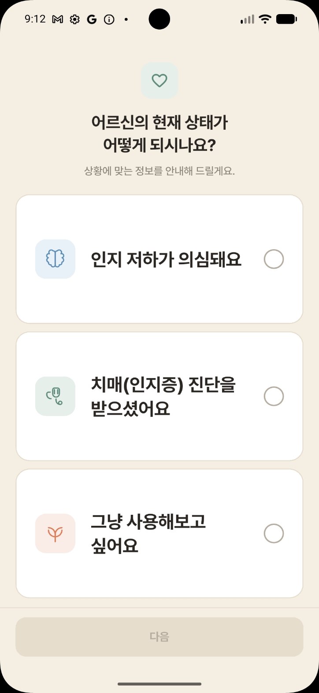
  <br/><sub>온보딩 — "어르신의 현재 상태가 어떻게 되시나요?" (인지 저하 의심 / 진단 받음 / 그냥 사용해보고 싶어요)</sub>
</p>

### ① 메모리북 — 매번 처음부터 설명하지 않아도 되는 인계


환자의 지병, 복용 약물, 장기요양등급, 진단명 등 돌봄에 필수적인 기본 정보를 문서화하여 보호자와 요양보호사가 함께 확인하는 기능입니다.
**요양보호사 교체 시마다 처음부터 다시 설명해야 했던 반복 노동을 제거**합니다.

- **①-1. 환자 기본 정보 카드** — 지병, 복약 이력, 알레르기, 장기요양등급, 진단명을 항목별로 구조화하여 입력·조회
- **①-2. 돌봄 그룹 공유 권한** — 형제자매 등 돌봄 참여 가족이 동일 정보에 접근 (Phase 2부터 요양보호사 포함)
- **①-3. 변경 이력 관리** *(예정)* — 약 용량 변경, 등급 갱신 등 이력 추적

| 구분 | 항목 |
|------|------|
| 의료 정보 | 혈액형, 장기요양등급, 치매 유형, 동반질환, 금기사항, 복용 약물, PRN(필요시) 약물, 주치의 |
| 행동/성격 | 좋아하는 것 / 싫어하는 것, **진정되는 말 / 효과 없는 말**, 일몰증후군, 반복 행동, **배회 경로** |
| 비상 | 비상 연락처, 선호 병원, 특이사항 |

> 메모리북 데이터는 **AI 시온이의 프롬프트에 자동 주입**되어 환자 맞춤 답변의 근거가 됩니다.

<br clear="right"/>

### ② 가족 돌봄 캘린더 — 복잡한 일정·절차를 한눈에


치매 의심·진단 전후로 **검사·진료·행정 절차가 짧은 기간에 몰리는 문제**를, 가족이 하나의 캘린더에서 공유·관리하도록 지원합니다. 일정마다 **담당자를 지정**해 돌봄이 한 사람에게 쏠리지 않도록 합니다.

| 분류 | 예시 |
|------|------|
| 의료 일정 | 신경과 진료, 인지기능검사, 치료제 처방 갱신 |
| 행정 · 제도 일정 | 등급 재심사, 치료관리비 신청, 조호물품 재신청 |
| 안전 관련 일정 | 배회 감지기 갱신, 국가건강검진 |
| 보험 일정 | 치매·손실보험 갱신, 청구 기한 |
| 프로그램 · 모임 일정 | 가족 교실, 자조모임, 인지재활 |
| 요양보호사 일정 | 방문 스케줄, 교체 예정일 |

<br clear="right"/>

### ③ 커뮤니티 — 다양한 사용자들과 함께

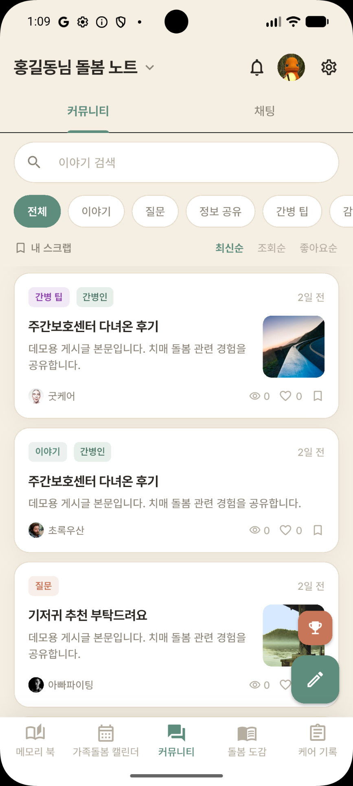

보호자와 간병인이 모두 참여하는 하나의 공간입니다. 보호자가 고민을 게시하고, 간병인이 질문에 답할 수 있습니다.
간병인 참여는 특정 환자와의 배정 관계를 전제하지 않는 **공개 공간**으로, **Phase 1부터 운영**합니다.

**[신뢰도]를 대체하는 두 가지 지표**
- 🏅 **경력 인증 배지** *(예정)* — 실제 돌봄 경력 인증자에게 별도 부여, 내공점수와 독립 표시
- 📈 **내공 점수** — 답변 활동·채택 여부 기반, 모든 이용자에게 동일 기준 적용 (채택 시 **+10**, 점수 기반 랭킹)

**그 밖의 기능**
- 게시글·댓글·대댓글, 좋아요·스크랩, 카테고리 필터, 키워드 검색
- 최신순(**커서 페이징**) / 조회수·좋아요순(오프셋 페이징)
- 신고 누적 **5회 자동 숨김 / 10회 자동 삭제**

<br clear="right"/>

### ④ 돌봄도감 & AI 시온이 — 빠르고 간편하게 정보를 습득

<p>
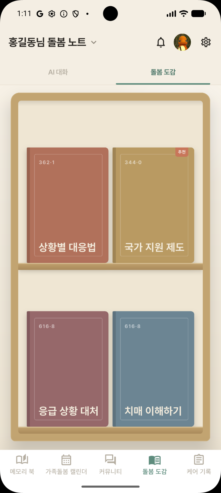

</p>

**돌봄도감**은 보호자들이 반복적으로 검색하는 기본 정보를 **공식 자료 기반으로 정리**한 정보 사전입니다. (상황별 대응법 · 국가 지원 제도 · 응급 상황 대처 · 치매 이해하기)
검색할 때마다 출처와 신뢰도를 스스로 판단해야 했던 부담을 줄입니다.

**AI 시온이**는 **어르신의 기본 정보(메모리북) + 공식 정보(RAG)** 를 함께 사용해 해결책을 제시합니다.
1. 환자의 정보를 기반으로 **맞춤 정보** 제공
2. 보호자 및 간병인에게 **문제 해결 방안** 제시

- 세션 기반 대화 (환자별 세션 목록·이력 관리)
- "그건요?", "그럼 어떡해요?" 같은 지시 표현을 위해 **직전 AI 답변을 검색 쿼리에 결합**
- 의학적 진단은 하지 않도록 프롬프트 가드레일 설정, 벡터 검색 실패 시 RAG 없이 응답하는 **graceful degradation**

### ⑤ 케어 기록 — 어르신의 새로운 정보 습득

<p>

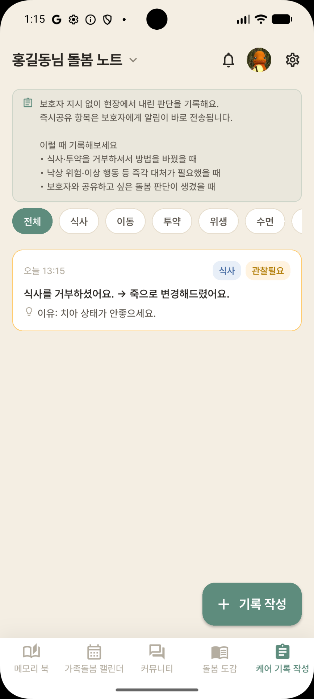
</p>

요양보호사가 **보호자의 사전 지시 없이** 낮 동안 독자적으로 내려야 했던 조치를 **상황 · 조치 · 이유** 세 가지 구조로 짧게 남기는 기록 기능입니다.
*사전 지시 범위를 벗어난 조치가 발생했을 때만 작성합니다.* — **Phase 2** (등급 판정 완료 등록 또는 요양보호사 배정 시)

- **⑤-1. 기록 작성** — 요양보호사가 상황/조치/이유를 짧은 구조로 작성, **작성 시점 자동 고정**
- **⑤-2. 검색·필터 조회** — 보호자가 카테고리·기간별로 과거 기록을 검색해 의사결정에 참고
- **⑤-3. 개별 조회** — 시점 고정 상태로 단건 확인, 이견 발생 시 **근거 자료**로 활용
- 카테고리 8종: 식사 / 이동 / 투약 / 위생 / 수면 / 행동 / 안전 / 기타
- 긴급도 3단계: 일반 / 관찰필요 / **즉시공유** → 즉시공유 시 그룹 내 보호자에게 **실시간 FCM 푸시**

### ➕ 부가 기능 (백엔드 지원)
- **초대코드 기반 돌봄 그룹** — 환자 등록 시 8자리 초대코드 발급, 가족·요양보호사가 코드로 합류 (N:M)
- **1:1 실시간 채팅** — WebSocket(STOMP), 텍스트·이미지·파일, 읽음 처리, FCM 푸시
- **기억 갤러리** — 환자별 사진 아카이브 (S3)
- **회원/인증** — 이메일 + 소셜 로그인(Google·Kakao·Line) + 온보딩, JWT(액세스 30분 / 리프레시 14일, Token Rotation)
- **관리자** — 서비스 통계, 회원·게시글 관리, 신고 처리

---

## 🧭 사용자 시나리오

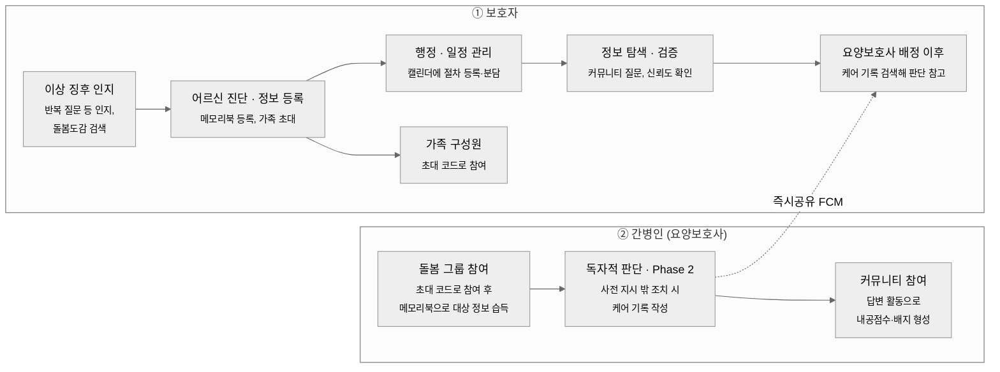

### 케어 기록 즉시공유 흐름

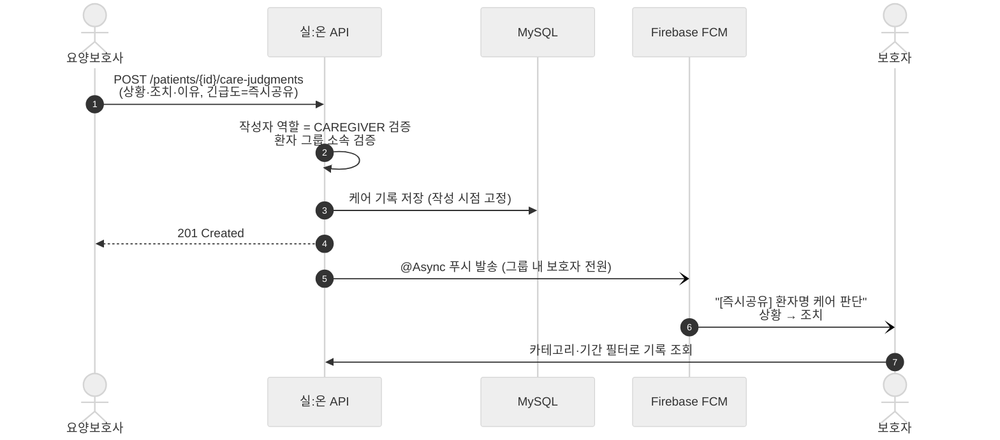

### AI 시온이 질문 흐름

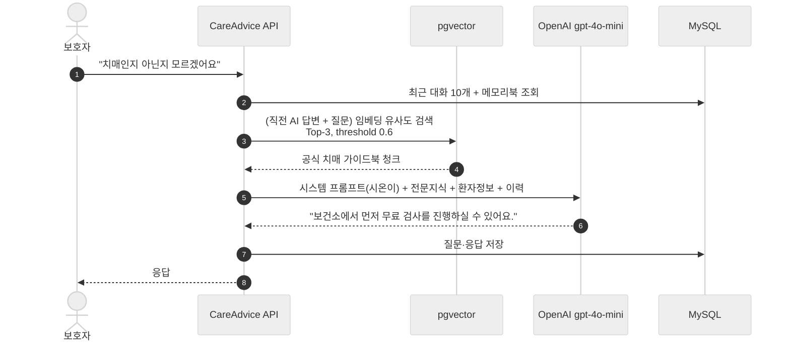

---

## 💡 차별점

| 비교 대상 | 대상 서비스의 특성 | **실:온**의 차별점 |
|-----------|--------------------|--------------------|
| 온라인 커뮤니티 (치노사모 등) | 이용자가 정보를 **직접 탐색·검증** | AI가 **상황에 맞는 정보**와 유사 사례를 **먼저 제시** |
| 재가급여전자관리시스템 (RFID) | 서비스 제공 시간의 **인증·청구** 목적 | 판단의 상황·조치·이유를 기록하는 **소명** 목적 |
| 간병인 매칭 플랫폼 | 이미 간병인이 필요한 시점 대상, 매일 작성되는 일지 | **진단 전후 정보 폭발기** 대상, **판단 이탈 시점만** 선별 기록 |

> **기존 서비스와 목적 · 대상이 겹치지 않는 시장 공백을 겨냥합니다.**

---

## 🛠 기술 스택

| 구분 | 기술 |
|------|------|
| **Language / Framework** | Java 21, Spring Boot 3.5.0 |
| **Security** | Spring Security, JWT (JJWT 0.13.0), OAuth 소셜 로그인 (Google·Kakao·Line) |
| **Persistence** | Spring Data JPA, MySQL 8, HikariCP |
| **AI / RAG** | Spring AI 1.0.0, OpenAI (gpt-4o-mini, text-embedding-3-small) |
| **Vector Store** | PostgreSQL 16 + pgvector 0.8.0 |
| **Realtime** | WebSocket (STOMP) |
| **Push** | Firebase Cloud Messaging (FCM) |
| **Storage** | AWS S3 |
| **Cache / Async** | Spring Cache, `@Async` |
| **Mapping / Util** | Lombok, MapStruct |
| **API Docs** | springdoc-openapi 2.8.8 (Swagger UI) |
| **Build** | Maven |

---

## 🏗 시스템 아키텍처

<div align="center">
  
</div>

### 백엔드 내부 구성

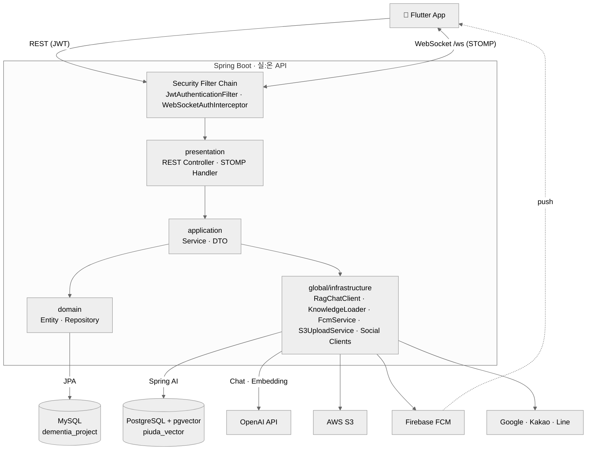

### RAG 파이프라인 (AI 시온이)


- `knowledge.reload-on-startup=false`(기본): `vector_store`가 비어 있을 때만 인덱싱 → 재시작 시 임베딩 비용 절감
- `knowledge.pdf-start-page=5`: 매뉴얼 표지·목차 페이지 제외 (5페이지 미만 PDF는 전체 읽기)

---

## 🔍 주요 설계 포인트

| 주제 | 설계 | 이유 |
|------|------|------|
| **데이터소스 이원화** | 운영 데이터는 MySQL(JPA), 벡터는 PostgreSQL·pgvector. `VectorStoreConfig`에서 PG DataSource를 **빈으로 노출하지 않고** 수동 구성 | JPA 자동 구성과의 DataSource 충돌 방지, 저장소 특성별 분리 |
| **도메인형 계층 구조** | 모든 도메인이 `presentation → application → domain` 3계층을 동일하게 가짐 | 도메인 추가·제거 시 영향 범위를 패키지 단위로 한정 |
| **N+1 완화** | `hibernate.default_batch_fetch_size=100` | 지연로딩 연관 엔티티를 IN 쿼리로 묶어 조회 |
| **커넥션 점유 최소화** | `spring.jpa.open-in-view=false`, 응답 DTO는 트랜잭션 내 생성 | 외부 API(OpenAI 등) 대기 중 DB 커넥션 반환 |
| **비동기 푸시** | `FcmService`에 `@Async` | FCM 지연·실패가 API 응답 시간에 영향 주지 않도록 분리 |
| **랭킹 캐싱** | 내공점수 랭킹 `@Cacheable` + `score DESC` 인덱스 | 조회 빈도가 높은 랭킹의 반복 정렬 비용 절감 |
| **토큰 보안** | 액세스 30분 / 리프레시 14일, 재발급 시 **Token Rotation**, 사용자당 리프레시 토큰 1개 | 탈취된 리프레시 토큰의 재사용 창 최소화 |
| **WebSocket 인가** | STOMP CONNECT 시 `WebSocketAuthInterceptor`에서 JWT 검증 | HTTP 필터를 거치지 않는 WebSocket 채널도 동일한 인증 적용 |
| **권한 검증** | 케어 기록 작성은 `CAREGIVER`만, 환자 리소스는 `PatientMember` 소속 여부 검증 | 같은 환자 그룹 외부에서의 접근 차단 |
| **커뮤니티 자정 작용** | 신고 누적 임계값(5/10) 기반 자동 숨김·삭제 | 운영자 개입 전에도 유해 게시물 노출 최소화 |

---

## 🗂 데이터베이스 스키마 (ERD)

<div align="center">
  <a href="docs/images/erd.png"></a>
  <br/><sub>클릭하면 원본 크기로 볼 수 있습니다. (<code>devices</code> · <code>voice_records</code> · <code>device_tts_messages</code>는 IoT 스피커 기획 단계의 테이블로, 현재 코드에서는 제거되었습니다.)</sub>
</div>

### 도메인 관계 요약 (Mermaid)

```mermaid
erDiagram
    users ||--o| caregiver_profiles : "간병인 프로필"
    users ||--o| refresh_tokens : "토큰"
    users ||--o{ patient_members : "참여"
    patients ||--o{ patient_members : "돌봄 대상"
    patients ||--o| patient_memories : "신상·의료 정보"

    patients ||--o{ care_judgment_logs : "케어 기록"
    users ||--o{ care_judgment_logs : "작성(간병인)"
    patients ||--o{ care_calendars : "케어 일정"
    users ||--o{ care_calendars : "작성/담당"
    patients ||--o{ memory_galleries : "기억 갤러리"
    users ||--o{ memory_galleries : "업로드"

    patients ||--o{ care_advice_sessions : "상담 대상"
    users ||--o{ care_advice_sessions : "상담 요청"
    care_advice_sessions ||--o{ care_advice_messages : "대화"

    users ||--o{ posts : "작성"
    posts ||--o{ post_images : "첨부"
    posts ||--o{ comments : "댓글"
    users ||--o{ comments : "작성"
    comments ||--o{ comments : "대댓글"
    posts ||--o{ post_likes : "좋아요"
    users ||--o{ post_likes : "좋아요"
    posts ||--o{ post_scraps : "스크랩"
    users ||--o{ post_scraps : "스크랩"
    users ||--o{ reports : "신고"

    users ||--o{ chat_rooms : "참여(1:1)"
    chat_rooms ||--o{ chat_messages : "메시지"
    users ||--o{ chat_messages : "발신"

    users {
        bigint user_id PK
        varchar email UK
        varchar password
        varchar name
        varchar nickname UK
        enum role "PROTECTOR / CAREGIVER / MEDICAL_STAFF"
        enum provider "LOCAL / GOOGLE / KAKAO / LINE"
        varchar provider_id
        int score
        boolean onboarding_done
        varchar fcm_token
    }
    caregiver_profiles {
        bigint caregiver_id PK, FK
        int inner_score
        int experience_years
        enum caregiver_type
        date birth_date
    }
    refresh_tokens {
        bigint id PK
        bigint user_id FK, UK
        varchar token UK
        datetime expiry_date
    }
    patients {
        bigint patient_id PK
        varchar name
        date birth_date
        enum gender
        enum dementia_stage
        varchar invite_code UK
    }
    patient_members {
        bigint patient_id PK, FK
        bigint user_id PK, FK
        varchar relationship
        datetime joined_at
    }
    patient_memories {
        bigint patient_memory_id PK
        bigint patient_id FK, UK
        varchar dementia_type
        text medication_info
        text soothing_words
        text wandering_route
        text special_notes
    }
    care_judgment_logs {
        bigint judgment_id PK
        bigint patient_id FK
        bigint writer_id FK
        enum category "식사/이동/투약/위생/수면/행동/안전/기타"
        text situation "상황"
        text action "판단"
        text rationale "근거"
        enum urgency "일반/관찰필요/즉시공유"
    }
    care_calendars {
        bigint calendar_id PK
        bigint patient_id FK
        bigint writer_id FK
        bigint assignee_id FK
        varchar title
        enum calendar_type
        enum category
        datetime start_time
        datetime end_time
    }
    memory_galleries {
        bigint gallery_id PK
        bigint patient_id FK
        bigint writer_id FK
        varchar image_url
        text memo
    }
    care_advice_sessions {
        bigint session_id PK
        bigint user_id FK
        bigint patient_id FK
        datetime created_at
    }
    care_advice_messages {
        bigint message_id PK
        bigint session_id FK
        enum role "USER / ASSISTANT"
        text content
    }
    posts {
        bigint post_id PK
        bigint writer_id FK
        varchar title
        text content
        enum category
        int like_count
        int view_count
        boolean has_adopted
        boolean hidden
    }
    post_images {
        bigint post_image_id PK
        bigint post_id FK
        varchar image_url
    }
    comments {
        bigint comment_id PK
        bigint post_id FK
        bigint writer_id FK
        bigint parent_comment_id FK
        text content
        boolean is_adopted
        boolean hidden
    }
    post_likes {
        bigint post_like_id PK
        bigint post_id FK
        bigint user_id FK
    }
    post_scraps {
        bigint post_scrap_id PK
        bigint post_id FK
        bigint user_id FK
        datetime scrapped_at
    }
    reports {
        bigint id PK
        bigint reporter_id FK
        enum target_type "POST / COMMENT"
        bigint target_id
        enum reason
        enum status
    }
    chat_rooms {
        bigint id PK
        bigint user1_id FK
        bigint user2_id FK
        text last_message
        datetime last_message_at
    }
    chat_messages {
        bigint id PK
        bigint chat_room_id FK
        bigint sender_id FK
        enum message_type "TEXT / IMAGE / FILE"
        text content
        boolean is_read
    }
```

- **MySQL** (`dementia_project`): 회원·환자·판단기록·커뮤니티·채팅 등 운영 데이터
- **PostgreSQL** (`piuda_vector`): `vector_store` — RAG 지식 임베딩

주요 관계
- `users` ⇄ `patients` : **N:M** (중간 테이블 `patient_members` — 보호자·간병인 공동 돌봄)
- `patients` 1 : N `care_judgment_logs` / `care_calendars` / `memory_galleries` / `care_advice_sessions`
- `posts` 1 : N `comments` / `post_images`, `users` 1 : N `posts`

---

## 🔌 API 개요

> 전체 명세는 실행 후 Swagger UI(`http://localhost:8080/swagger-ui.html`)에서 확인할 수 있습니다.

| 도메인 | Base Path | 주요 엔드포인트 |
|--------|-----------|-----------------|
| 회원 | `/api/v1/users` | `POST /signup` · `POST /login` · `POST /refresh` · `POST /logout` · `POST /onboarding` · `GET·PUT·DELETE /me` · `GET /check-nickname` · `GET /ranking` · `PUT /fcm-token` · `GET /{nickname}/profile` |
| 소셜 로그인 | `/api/v1/auth` | `POST /google` · `POST /kakao` · `POST /line` |
| 환자 | `/api/v1/patients` | `POST /` · `POST /join` (초대코드) · `GET /my` · `GET·PUT·DELETE /{patientId}` |
| 메모리북 | `/api/v1/patients/{patientId}/patient-memory` | `GET` · `PUT` |
| 케어 기록 | `/api/v1/patients/{patientId}/care-judgments` | `POST` · `GET` · `GET·PUT·DELETE /{logId}` |
| 캘린더 | `/api/v1` | `POST·GET /patients/{patientId}/calendars` · `GET·PUT·DELETE /calendars/{calendarId}` |
| 기억 갤러리 | `/api/v1/patients/{patientId}/gallery` | `POST /photos` (multipart) · `GET /photos` · `DELETE /photos/{galleryId}` |
| AI 시온이 | `/api/v1` | `POST·GET /patients/{patientId}/care-advice/sessions` · `POST·GET /care-advice/sessions/{sessionId}/messages` · `DELETE /care-advice/sessions/{sessionId}` |
| 게시글 | `/api/v1/posts` | `POST` (multipart) · `GET` · `GET·PUT·DELETE /{postId}` · `POST /{postId}/likes` · `POST·DELETE /{postId}/scraps` · `GET /scraps` |
| 댓글 | `/api/v1` | `POST·GET /posts/{postId}/comments` · `PUT·DELETE /comments/{commentId}` · `POST·DELETE /posts/{postId}/comments/{commentId}/adopt` |
| 신고 | `/api/v1` | `POST /posts/{postId}/reports` · `POST /comments/{commentId}/reports` |
| 채팅 | `/api/v1/chats` | `POST` · `GET` · `GET /{roomId}/messages` · `POST /{roomId}/files` · `PATCH /{roomId}/read` · `DELETE /{roomId}` |
| 채팅 (STOMP) | `/ws` | 발행 `/app/chat/{roomId}` · 구독 `/topic`, `/queue` |
| 관리자 | `/api/v1/admin` | `GET /stats` · `GET /users` · `DELETE /users/{userId}` · `GET /posts` · `DELETE /posts/{postId}` · `GET /reports` · `PATCH /reports/{reportId}/dismiss` |

### 인증
- 대부분의 엔드포인트는 `Authorization: Bearer <accessToken>` 헤더 필요
- 인증 불필요: 회원가입 / 로그인 / 토큰 재발급 / 닉네임 중복확인, 소셜 로그인, 게시글·댓글 조회
- JWT 클레임: `userId`, `email`, `role`

---

## 📁 프로젝트 구조

```
project.piuda
├── PiudaApplication.java        # @EnableCaching · @EnableAsync
├── domain/                      # 도메인별 패키지 (각 도메인 = 3계층)
│   ├── user/                    # 회원 · 인증(JWT) · 랭킹
│   ├── auth/                    # 소셜 로그인 (Google·Kakao·Line)
│   ├── patient/                 # 환자 등록 · 초대코드 합류
│   ├── patientmemory/           # 메모리북 (환자 신상 · 의료 정보)
│   ├── calendar/                # 가족 돌봄 캘린더
│   ├── carejudgment/            # ⭐ 케어 기록 (상황·조치·이유)
│   ├── careadvice/              # 돌봄도감 AI 시온이 (RAG)
│   ├── memorygallery/           # 기억 갤러리 (사진)
│   ├── community/               # 게시글 · 댓글 · 좋아요 · 스크랩 · 채택
│   ├── chat/                    # 1:1 실시간 채팅
│   ├── report/                  # 신고 · 자동 숨김/삭제
│   └── admin/                   # 관리자 통계 · 관리
│       ├── presentation/        #   Controller (HTTP 요청 처리)
│       ├── application/         #   Service + dto (비즈니스 로직)
│       └── domain/              #   Entity + Repository (영속성)
└── global/                      # 전 도메인 공통 인프라
    ├── security/                # JWT 필터 · Spring Security · WebSocket 인가
    ├── config/                  # VectorStore · WebSocket · S3 · Swagger · RestTemplate
    ├── infrastructure/          # S3 · FCM · RAG · 소셜 클라이언트 · 지식 로더
    └── exception/               # 전역 예외 처리
```

---

## 🚀 로컬 실행 방법

### 사전 요구사항
- **JDK 21**
- **MySQL 8** 로컬 3306 포트, `dementia_project` 스키마 생성
- **PostgreSQL 16** 로컬 5432 포트, `piuda_vector` 스키마 + `vector` 확장 활성화

```sql
-- PostgreSQL
CREATE DATABASE piuda_vector;
\c piuda_vector
CREATE EXTENSION IF NOT EXISTS vector;
```

### 환경변수 (IDE Run Configuration 또는 셸)
```bash
JWT_SECRET=...                       # HS256용 시크릿 (32바이트 이상 권장)
MYSQL_PASSWORD=...
PGVECTOR_PASSWORD=...
OPENAI_API_KEY=...
AWS_ACCESS_KEY=...
AWS_SECRET_KEY=...
GOOGLE_CLIENT_ID=...
LINE_CLIENT_ID=...
FCM_SERVICE_ACCOUNT_KEY_PATH=...     # (선택) 없으면 푸시 비활성화
```

### 빌드 & 실행
```bash
# 빌드
./mvnw clean package -DskipTests

# 로컬 실행
./mvnw spring-boot:run

# 전체 테스트
./mvnw test
```

### 지식 베이스 준비 (RAG)
- `src/main/resources/knowledge/`에 치매 케어 매뉴얼 PDF 또는 JSON을 배치합니다. (`.gitignore` 처리되어 환경마다 직접 배치 필요)
- JSON 형식: `[{"title": "...", "content": "..."}]` — `content` 필드가 벡터화됩니다.
- 지식 파일을 교체했다면 `TRUNCATE vector_store` 후 `knowledge.reload-on-startup=true`로 한 번 실행합니다.

---

## 📈 기대 효과 & 사업화

### 01. 이용자 효과

> **개별 판단이 누적되어, 신뢰 가능한 자산이 된다**

**① 보호자**

| 기간 | 핵심 변화 | 기대 수준 |
|------|-----------|-----------|
| 단기 | 구두 전달 → 구조화된 기록으로 전환 | 주 3일 이상 기록 |
| 중기 | 정보 공백 · 반복 설명 부담 감소 | 반복 질문 재게시율 감소 |
| 장기 | 누적 데이터가 의사결정 근거로 활용 | 장기 이용자 50%↑ 활용 |

**② 간병인 (요양보호사)**

| 기간 | 핵심 변화 | 기대 수준 |
|------|-----------|-----------|
| 단기 | 메모리북으로 인수인계 시간 단축 | 인수인계 시간 감소 |
| 중기 | 판단 이력 축적, 신뢰도 지표 형성 | 내공점수·배지 다수 보유 |
| 장기 | 축적 기록이 전문성 증빙 자료로 기능 | 분쟁 시 소명 조회 활용 |

### 02. 사회적 기대 효과 — SROI 산출

Input → Activity → Output → Outcome → Impact **5단계 화폐 가치 환산**

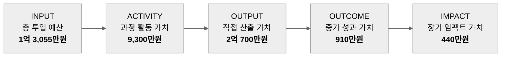

| 구분 | 사회적 가치 산출 근거 (요약) |
|------|------------------------------|
| Activity | 메모리북 · 케어 기록 · 커뮤니티 활동 시간을 최저임금 기준으로 환산 (DW 25%) |
| Output | 반복 질문 감소에 따른 정보 탐색 절감 + 메모리북 인수인계 시간 절감 (DW 10%) |
| Outcome | 가족(직장인)의 돌봄 부담 경감 → 이직(돌봄퇴사) 방지 → 재고용·교육비 등 사회적 비용 회피 (DW 35% · 기여도 20%) |
| Impact | 재가 돌봄 유지 기간 연장에 따른 시설 입소 비용 회피 (Attr 10%) |

> ### 💰 투입 1원당 약 **2.4원**의 사회적 가치 창출
> net 3억 1,350만원 ÷ INPUT 1억 3,055만원 (미보정 3.64배 → 보정 2.40배)

<details>
<summary>SROI 산출 상세 (INPUT · 5단계 보정계수)</summary>

**공식**: `net = Raw × (1 − Deadweight) × Attribution`
- **Deadweight(사중손실)**: 서비스가 없어도 어차피 발생했을 부분
- **Attribution(기여도)**: 결과에 영향을 미치는 요인 개수의 역수(1/N)로 균등 배분

**INPUT 산출 근거** — 총합 1억 3,055만원

| 항목 | 금액 | 산정 근거 |
|------|------|-----------|
| 인건비(기회비용) | 1억 2,640만원 | 개발·기획·디자인·운영 4개 직군 선임 평균연봉 환산 |
| 인프라·AI API | 240만원 | 월 20만원 × 12개월 (개발팀 실측 운영비 기준) |
| 마케팅·운영비 | 175만원 | 협업툴 60 + 앱스토어 15 + 리서치 30 + 기관제휴 20 + 커뮤니티 시딩 50 (만원) |

**5단계 Raw 산출 · 보정 결과**

| 단계 | Raw 산출액 | Deadweight | Attribution | 순 사회적 가치(net) |
|------|-----------|-----------|-------------|---------------------|
| Activity | 1억 1,630만원 | 20% | 100% | 9,300만원 |
| Output | 2억 3,000만원 | 10% | 100% | 2억 700만원 |
| Outcome | 7,000만원 | 35% | 20% | 910만원 |
| Impact | 5,850만원 | 25% | 10% | 440만원 |
| **합계** | **4억 7,480만원** | | | **3억 1,350만원** |

**단계별 보정계수 근거**

| 단계 | Deadweight 근거 | Attribution 근거 |
|------|-----------------|------------------|
| Activity | 가족돌봄·기존 봉사활동으로도 제한적으로 발생 가능 (20%) | 서비스 이용을 통해서만 발생하는 직접 산출물 → 요인 1개 = 100% |
| Output | 기존 수기 관리로도 일부 달성 가능 (10%) | 서비스 이용을 통해서만 발생하는 직접 산출물 → 요인 1개 = 100% |
| Outcome | 법정 가족돌봄휴가·휴직·유연근무제(남녀고용평등법 제22조의2)로도 이직 지연 효과 상당 부분 발생 가능 (35%) | 이직 방지 요인 5개 균등배분(1/5 = 20%): 유연근무제 · 가족돌봄휴가·휴직 · 급여수준 · 직무만족도 · 본 서비스 |
| Impact | 시설 입소 시점은 질병 진행(자연경과) 영향이 가장 큼 (25%) | 시설입소 지연 요인 10개 균등배분(1/10 = 10%): 질병진행·가족여건·의료진판단·요양등급·주거환경 등 9개 외부요인 + 본 서비스 |

보정 원칙: Cabinet Office · Social Value International, *A Guide to SROI Analysis*

</details>

### 03. 사업화 가능성 — 시장성과 경쟁우위

| 구분 | 타겟 시장 | 수익 모델 | 진입 전략 |
|------|-----------|-----------|-----------|
| 단기 | 치매 진단 전후 40~50대 가족 보호자 | 무료 베타 운영 및 CPM | 온라인 보호자 커뮤니티 기반 초기 유저 확보 |
| 중기 | 요양보호사 배정 재가 돌봄 가구 | 보호자 구독형 프리미엄 플랜 (B2C), 기관 대상 SaaS 파일럿 (B2G) | 공모전 실적 및 멘토 네트워크 기반 기관 협력 파일럿 |
| 장기 | 치매 외 노인성 질환 · 장애인 돌봄 | 요양병원 대상 기록 연동 SaaS (B2B) | 누적 판단 데이터 기반 시설 연계 확장 |

**경쟁 우위 — 후발 경쟁자가 단기간에 복제하기 어려운 자산**
- 치매안심센터 공식 매뉴얼 연계를 통한 **제도적 신뢰성**
- 누적 데이터로 형성되는 **신뢰 네트워크** (내공점수 · 경력 배지 · 케어 기록)

---

## 🚧 진행 사항 & 추후 계획

### 01. 진행 사항
- ✅ **핵심 기능 5종 구현 완료** (메모리북 · 가족 돌봄 캘린더 · 커뮤니티 · 돌봄도감/AI 시온이 · 케어 기록)
- 🔄 **ESP32 기반 생활 기록 보조 하드웨어(IoT 스피커) 제거** — 사용자들에게 사용 필요성이 낮다고 판단하여 앱 중심으로 전환 (백엔드 `device` 도메인 제거)

### 02. 이슈 및 변경 사항 — 하루 일지 → 케어 기록

<table>
<tr>
<th width="50%">Before · 하루 일지</th>
<th width="50%">After · 케어 기록 (멘토링 피드백 반영)</th>
</tr>
<tr>
<td align="center">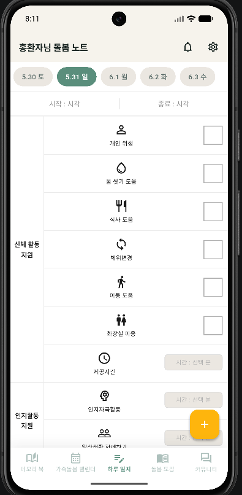</td>
<td align="center">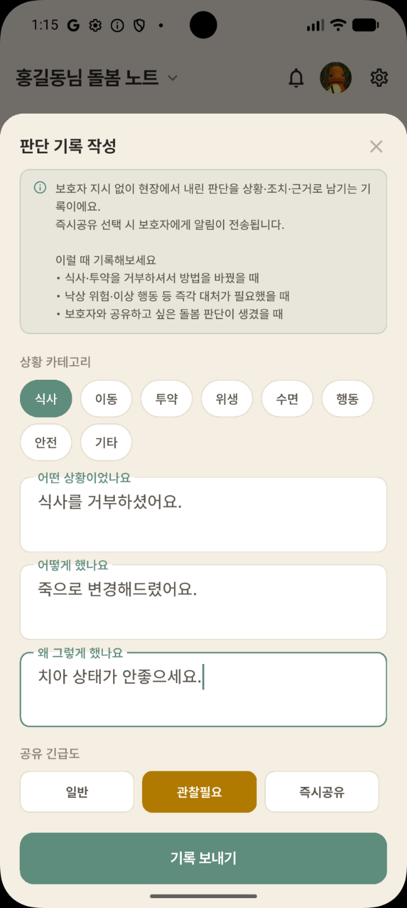</td>
</tr>
<tr>
<td>

- 장기요양 제공 기록지를 기반으로 작성
- 항목별 수행 여부를 **체크하는 방식**
- 현장에서 내린 **판단 및 근거를 남기기 어려움**

</td>
<td>

- 간병인의 **현장 판단**을 기반으로 중요 정보를 기록
- **[상황 → 조치 → 이유]** 3단계로 구조화
- 사전 지시 범위를 벗어난 경우에만 작성해 기록 부담 최소화

</td>
</tr>
</table>

### 03. 추후 계획

**AI 시온이 대화 고도화 — Spring AI RAG → GraphRAG**

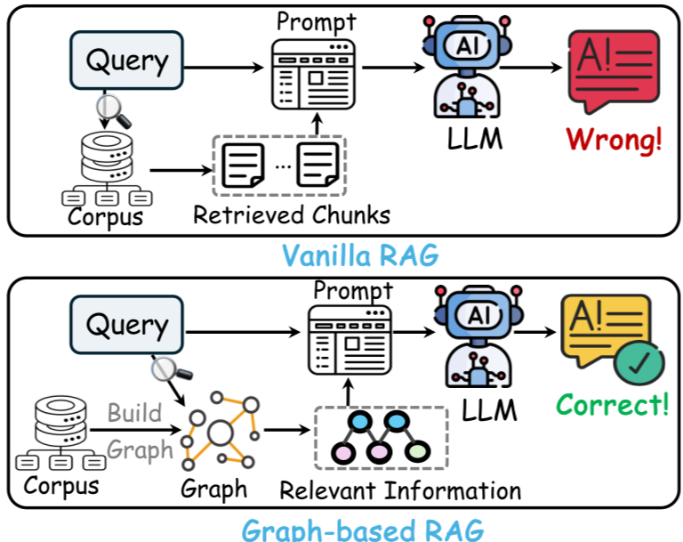

청크 단위 검색(Vanilla RAG)은 문서 간 관계를 놓쳐 부정확한 답변이 생길 수 있어, 지식 간 관계를 그래프로 구성하는 **Graph-based RAG**로 확장할 계획입니다.

**복용 약물 기입 고도화 — OCR**

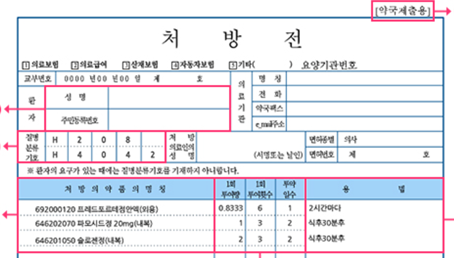

현재 텍스트로 직접 입력하는 메모리북의 복용 약물을, **처방전·진단서 사진 촬영만으로 자동 인식·입력**하도록 개선합니다.
> 예) OCR 처리 후 TEXT: `레드포르데점안액(외용), 파오시드 정 20mg, 슬로젠정(내복)`

### 04. 실증 계획

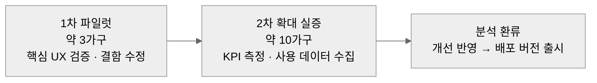

| 실증 개요 | | 성공 지표 (KPI) | |
|-----------|---|-----------------|---|
| 대상 | 치매 환자 가족 보호자 | 주간 사용률 | **60%↑** |
| 모집 | 복지 관련 멘토, 각종 커뮤니티 | 케어 노트 작성 | **주 3회↑** |
| 방법 | MVP 배포 → 사용 로그 + 사전·사후 설문 (**S-ZBI** 활용) | 보호자 부양부담 | **사전 대비 감소** |

---

## 🤝 팀 소개

**팀 피오리라** — 2026 글로벌 피우다프로젝트

| 이름 | 역할 |
|------|------|
| 최동현 (팀장) | 전체 아키텍처 및 풀스택 개발 |
| 송효정 | 기획 및 AI 개발 |
| 김지영 | 기획 및 UX 설계 |
| 이주은 | 하드웨어 개발 및 하드웨어 디자인 |

| 협업 | 방식 |
|------|------|
| 회의 | 주 최소 1회 대면/비대면 회의 |
| 문서 정리 | Notion |
| API 협업 | Swagger |
| 개발 방법론 | 애자일 (Agile) |

---

## 📚 참고 문헌
- 보건복지부, 「2025 치매역학조사」
- 중앙치매센터, 2024년 통계자료
- 후생노동성, 「국민생활기초조사(国民生活基礎調査) 2022」
- 니노미야(二宮), 2024, 일본 인지증 유병률 관련 자료
- 치노사모(치매노인을 사랑하는 모임), 네이버 카페 인지증(치매) Q&A 게시판 (2026.04.26 ~ 07.01 분석)
- Cabinet Office · Social Value International, *A Guide to SROI Analysis*
- 남녀고용평등과 일·가정 양립 지원에 관한 법률 제22조의2
- 최저임금위원회, 최저임금 고시자료

---

<div align="center">

**실:온 (Sil:On)** · 치매 진단 전후, 재가 돌봄 정보·기록 플랫폼

*실로 잇는 따뜻한 기억*

</div>
