<div align="center">

# 실:온 (Sil:On)

### 치매 환자를 돌보는 보호자와 간병인을 잇는 소통 중심 치매 돌봄 플랫폼

*간병인의 판단과 보호자의 신뢰 사이를 잇고, AI 상담사 **시온이**가 돌봄을 돕습니다.*

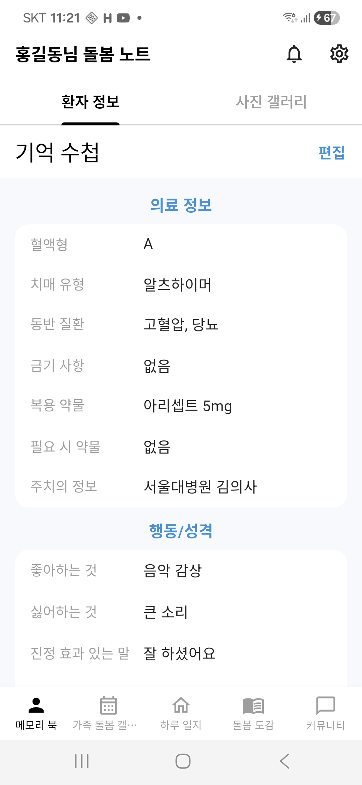
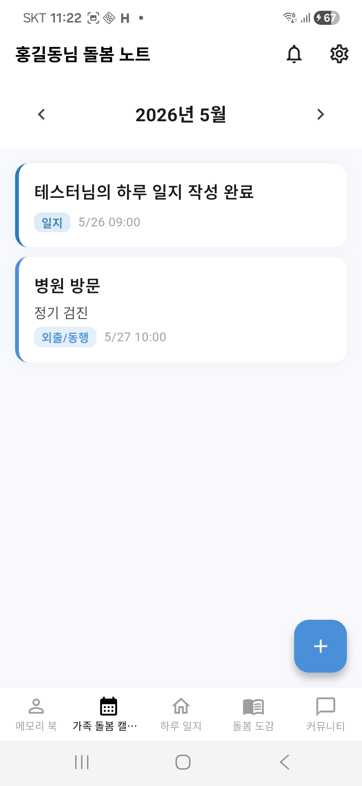
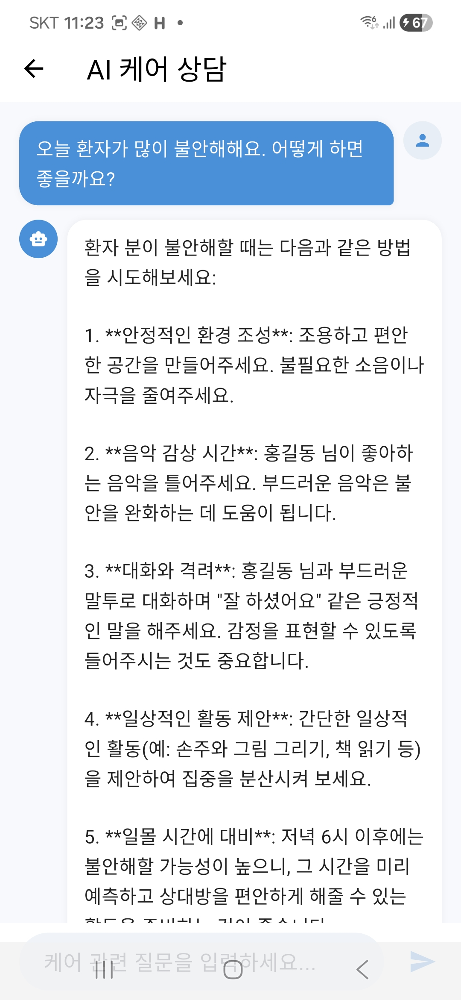


**2026 글로벌 피우다프로젝트** · 세부주제 (5) 치매 돌봄 및 가족지원 솔루션 · 팀 **피오리라**

</div>

---

## 📑 목차
1. [프로젝트 개요](#-프로젝트-개요)
2. [기획 배경](#-기획-배경)
3. [핵심 문제 정의](#-핵심-문제-정의)
4. [솔루션과 차별점](#-솔루션과-차별점)
5. [사용자 페르소나 & 시나리오](#-사용자-페르소나--시나리오)
6. [핵심 기능](#-핵심-기능)
7. [기술 스택](#-기술-스택)
8. [시스템 아키텍처](#-시스템-아키텍처)
9. [주요 설계 포인트](#-주요-설계-포인트)
10. [데이터베이스 스키마 (ERD)](#-데이터베이스-스키마-erd)
11. [API 개요](#-api-개요)
12. [프로젝트 구조](#-프로젝트-구조)
13. [로컬 실행 방법](#-로컬-실행-방법)
14. [기대 효과 & 사업화](#-기대-효과--사업화)
15. [팀 소개](#-팀-소개)

---

## 🩺 프로젝트 개요

**실:온**은 치매(인지증) 환자를 둘러싼 **보호자(가족) · 간병인 · 의료진**이 한 환자를 중심으로 기록을 공유하고, 같은 상황을 겪는 사람들과 연결되도록 돕는 **소통 중심의 치매 돌봄 플랫폼**입니다.

기존 치매 서비스가 인지검사·말동무·인지훈련처럼 **환자 개인**에게 집중했다면, 실:온은 돌봄 현장의 진짜 병목인 **"돌봄 관계자 사이의 정보 단절"** 에 집중합니다.

| 축 | 목표 | 대표 기능 |
|----|------|-----------|
| ① 돌봄 관계자 간 소통 | 보호자·가족·간병인이 하나의 공간에서 환자 정보를 함께 기록·공유 | 케어 판단 기록, 기억 수첩, 가족 돌봄 캘린더, 기억 갤러리, 1:1 채팅 |
| ② 같은 경험을 가진 사람들 간 소통 | 검증된 정보에 빠르게 닿고, 돌봄의 고립감을 덜어냄 | AI 케어 상담 **시온이**(RAG), 커뮤니티(내공점수·채택) |

> ⚠️ 실:온은 치매를 **진단하지 않습니다.** 돌봄 기록과 정보 공유를 돕는 서비스이며, 정확한 진단은 의료기관 방문을 권장합니다.

---

## 📊 기획 배경

### 출발점 — 요양원 봉사활동에서 본 "구조의 공백"
전문 요양시설에는 **케어 플랜 · 인수인계 기록 · 일일 관찰 일지**라는 체계적인 정보 관리 구조가 있습니다.
그러나 같은 환자가 **집으로 돌아가는 순간, 이 구조는 사라집니다.** 재가 돌봄 가족은 환자 정보를 기억과 단편적 메모에 의존하고, 장기요양등급·재가급여 같은 제도 정보에도 접근하기 어렵습니다.

비전문 보호자에게 필요한 것은 고도의 의료 지식이 아니라, **식사량·발화·수면·감정 상태 같은 일상 정보가 끊기지 않고 쌓이고 공유되는 구조**입니다.
실:온은 **전문 시설 수준의 기록·공유 구조를 재가 환경에서 구현**하는 것을 목표로 합니다.

### 숫자로 보는 치매 돌봄 현실

<table>
<tr><th>🇰🇷 대한민국</th><th>🇯🇵 일본 (약 10년 앞선 선행 시장)</th></tr>
<tr><td>

| 지표 | 수치 |
|------|------|
| 65세 이상 추정 치매 환자 (2025) | **약 97만 명** (유병률 9.17%) |
| 경도인지장애 유병률 | **28.42%** (4명 중 1명 이상) |
| 환자 1인당 연간 관리 비용 (2022) | **약 2,220만 원** |
| 국가 치매 관리 비용 | **20.8조 원** → 2040년 **78조 원+** |

</td><td>

| 지표 | 수치 |
|------|------|
| 65세 이상 인지증 환자 (2022) | **약 443만 명** (유병률 12.3%) |
| 고령자 대비 | 약 **8명 중 1명** |
| 2040년 전망 | **584만 명** |
| 사회 이슈 | 재가 개호 수요 급증 · 개호 인력 부족 · **노노케어** |

</td></tr>
</table>

### 돌봄은 "집"에서, "비전문 가족"이 하고 있다

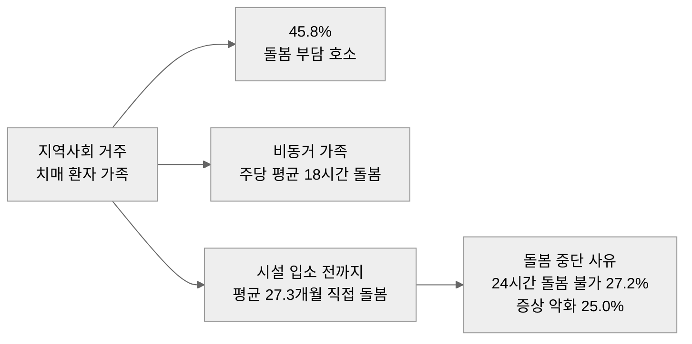

> 출처: 보건복지부 「2023년 치매역학조사」·「2023년 치매실태조사」, 일본 후생노동성 연구반(2024) 추계

---

## 🧩 핵심 문제 정의

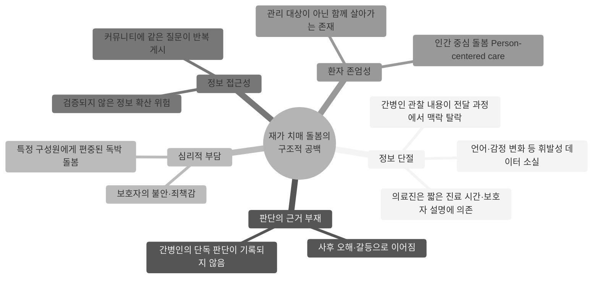

| # | 문제 | 현장에서 보이는 모습 |
|---|------|----------------------|
| 1 | **돌봄 과정의 정보 단절** | 가족·간병인·의료진이 서로 다른 정보를 분절적으로 보유. 간병인 교체 시 인수인계 수단이 없음 |
| 2 | **보호자·간병인의 심리적 부담** | 보호자는 환자 곁에 없는 시간 동안 불안, 간병인은 같은 설명을 반복하며 피로 누적 |
| 3 | **비전문 가족의 정보 접근성** | 대표 커뮤니티(네이버 카페 '치매노인을 사랑하는 모임')에서 유사 질문이 반복 — 매번 처음부터 탐색하는 비효율 |
| 4 | **환자 중심 돌봄의 필요성** | 일본 등 초고령사회에서 인간 중심 돌봄이 정책·임상 양면으로 강조 |

---

## 💡 솔루션과 차별점

### 문제 → 기능 매핑

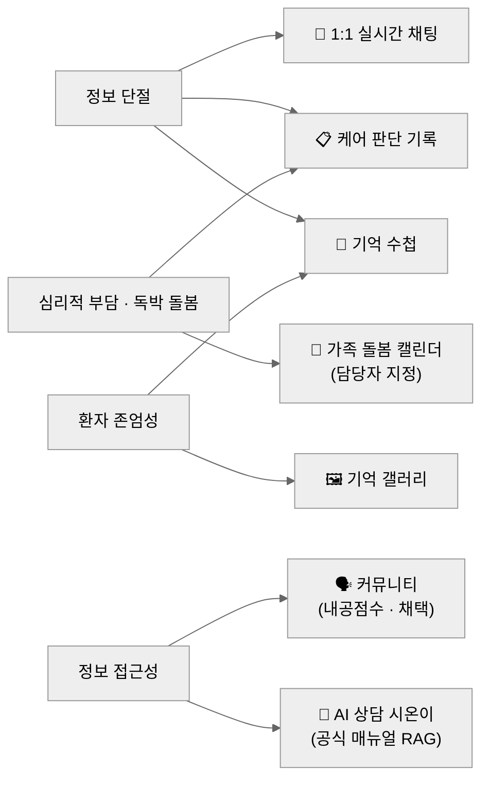

### 차별점

| 기존 치매 서비스 | 실:온 |
|------------------|-------|
| 환자 개인 대상(인지검사·말동무·인지훈련) | **돌봄 관계자 간 연결과 기록 공유**를 핵심 구조로 설계 |
| "모든 일상을 빠짐없이 기록" | **"판단이 필요한 순간"** 과 **"정보가 필요한 순간"** 에 집중 |
| 한 명의 보호자 계정 중심 | 초대코드 기반 **N:M 공동 돌봄 그룹** (보호자·가족·간병인) |
| 범용 LLM 챗봇 | 치매 케어 **공식 매뉴얼 RAG** + **환자 신상·의료 정보 자동 주입** |
| 익명 Q&A 커뮤니티 | **채택 기반 내공점수**로 정보 신뢰도 가시화, 신고 누적 자동 숨김 |

---

## 👥 사용자 페르소나 & 시나리오

### 페르소나

| 항목 | 👨‍👩‍👧 보호자·가족 | 🧑‍⚕️ 간병인 | 🧓 치매 환자 |
|------|-------------|---------|-----------|
| 대표 인물 | 40~60대 자녀, 배우자 | 20~50대 요양보호사, 파트타임 간병인 | 70~80대 경도~중등도 치매 |
| 생활 형태 | 원거리 거주 또는 직장인 — 상시 돌봄 불가 | 주 3~5회 방문, 교대 근무 | 자택 또는 주간보호센터 이용 |
| 핵심 불편 | 오늘의 식사·복약·상태를 알 수 없음 | 공식 인수인계 수단이 없음 | 스스로 기록·입력 불가 |
| 원하는 것 | **내가 없어도 안심할 수 있는 확인 수단** | **내 돌봄 판단이 인정받고 전달되는 것** | 익숙한 목소리, 존중받는 일상 |
| 실:온 접점 | 즉시공유 알림, 캘린더, 시온이, 커뮤니티 | 케어 판단 기록, 기억 수첩, 커뮤니티 | 기억 수첩·갤러리를 통한 간접 참여 |

### 사용자 관계

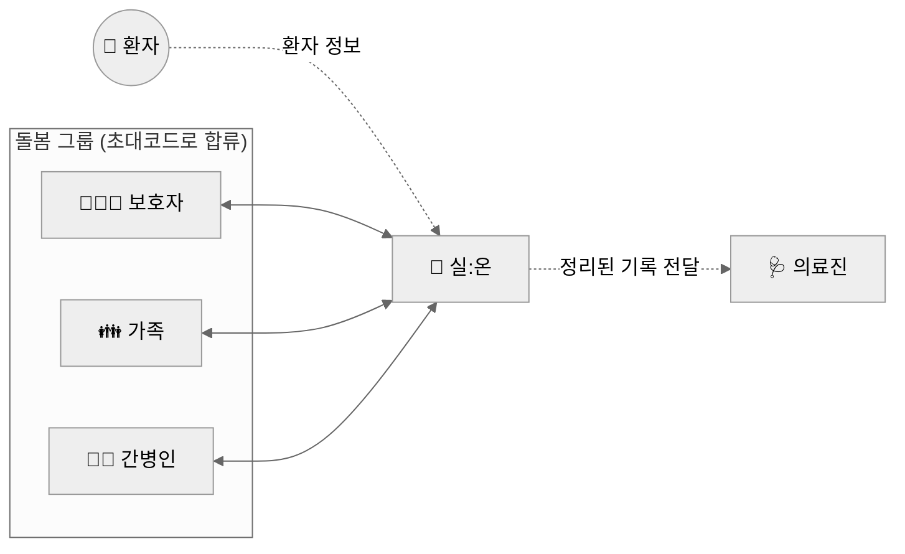

### 시나리오 1 — 돌봄 그룹 구성
1. 보호자가 회원가입(이메일 또는 Google·Kakao·Line) 후 **환자를 등록** → 기억 수첩 빈 레코드가 자동 생성되고 **8자리 초대코드** 발급
2. 가족·간병인이 초대코드로 합류 → 한 환자를 중심으로 **N:M 돌봄 그룹** 형성

### 시나리오 2 — 간병인의 단독 판단, 보호자에게 즉시 전달

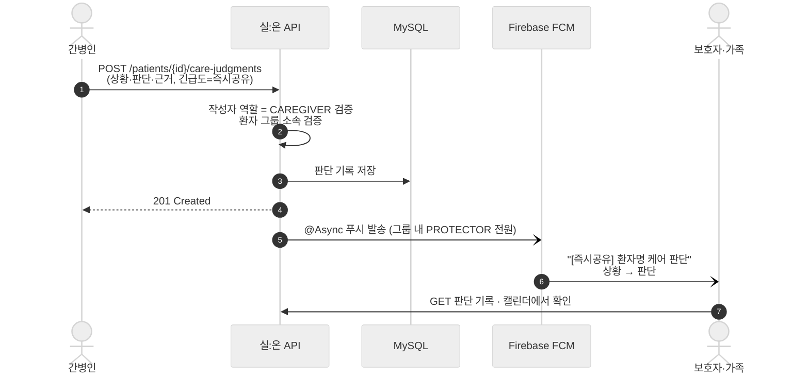

### 시나리오 3 — "이럴 땐 어떻게 하죠?" 시온이에게 묻기

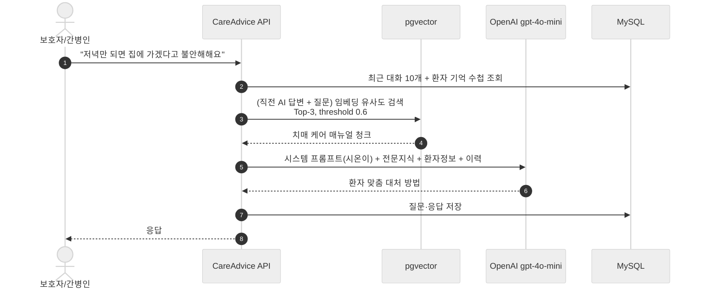

### 시나리오 4 — 역할 분담과 정보 공유
- **가족 돌봄 캘린더**로 병원 진료·방문요양 일정을 등록하고 **담당자를 지정** → 돌봄 책임이 한 사람에게 쏠리지 않도록 가시화
- **기억 수첩**에 좋아하는 것·싫어하는 것·진정되는 말·배회 경로를 기록 → 간병인이 바뀌어도 환자 이해가 끊기지 않음
- **커뮤니티**에서 같은 상황의 보호자·간병인과 경험을 나누고, 좋은 답변은 **채택**해 내공점수로 보상

---

## ✨ 핵심 기능

### 📋 케어 판단 기록 (핵심 차별점)
간병인이 보호자의 사전 지시 없이 내린 단독 판단을 **상황 · 판단 · 근거** 3요소로 기록하는 보관소. "왜 그렇게 했는지"가 남아 오해 대신 **신뢰 자산**이 됩니다.
- 8개 카테고리(식사/이동/투약/위생/수면/행동/안전/기타)로 분류·검색
- 긴급도 3단계 `NORMAL`(일반) / `NEEDS_OBSERVATION`(관찰필요) / **`IMMEDIATE`(즉시공유)** — 즉시공유 시 보호자에게 **실시간 FCM 푸시**
- 작성은 **간병인만**, 조회는 환자에 연결된 보호자·간병인 전원
- 캘린더 조회 시 판단 기록도 함께 표시

<!-- 👉 '하루 일지' 탭 스크린샷을 docs/images/judgment.jpg 로 추가해 주세요 -->

### 🤖 AI 케어 어드바이스 — 시온이
- 치매 돌봄 전문 AI 상담사 **'시온이'** 와 **세션 기반** 대화 (환자별 세션 목록/이력 관리)
- **RAG 파이프라인**: 치매 케어 지식(PDF·JSON) → pgvector 유사도 검색 → GPT 응답
- 환자의 신상·의료 정보(기억 수첩)를 자동으로 대화 맥락에 주입 → **환자 맞춤 답변**
- "그건요?", "그럼 어떡해요?" 같은 지시 표현을 위해 **직전 AI 답변을 검색 쿼리에 결합**
- 의학적 진단은 하지 않고 실제 돌봄에 집중하도록 프롬프트 가드레일 설정
- 벡터 검색 실패 시 RAG 없이 응답하는 **graceful degradation**


### 🧓 환자 관리 & 기억 수첩
- 환자 등록 및 **초대코드**로 보호자·간병인 합류 (N:M 공동 돌봄)
- 기억 수첩: 환자 1인당 1개 레코드로 신상·의료·행동 정보를 공동 관리

| 구분 | 항목 |
|------|------|
| 의료 | 혈액형, 장기요양등급, 치매 유형, 동반질환, 금기사항, 복용 약물, PRN(필요시) 약물, 주치의 |
| 행동·정서 | 좋아하는 것 / 싫어하는 것, **진정되는 말 / 효과 없는 말**, 일몰증후군, 반복 행동, **배회 경로** |
| 비상 | 비상 연락처, 선호 병원, 특이사항 |


### 📅 가족 돌봄 캘린더
- 병원 방문·방문요양 등 케어 일정 등록/관리, **담당자 지정**으로 역할 분담 가시화
- 판단 기록 통합 조회


### 🖼 기억 갤러리
- 환자별 사진 갤러리 (S3 저장) — 환자의 일상을 남기는 추억 아카이브

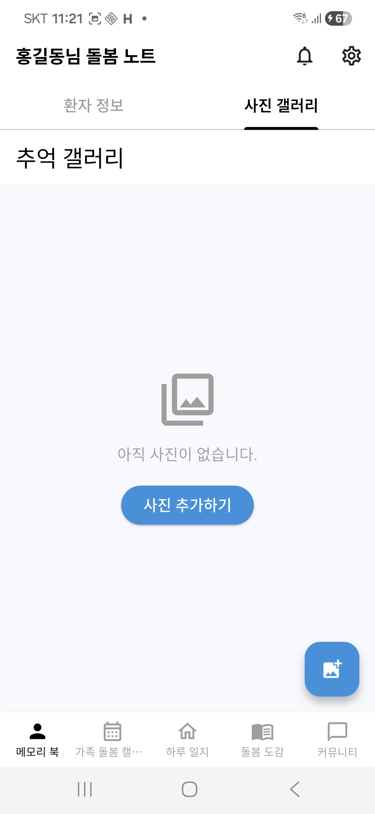

### 🗣 커뮤니티
- 게시글·댓글·대댓글, 좋아요·스크랩, 8개 카테고리(QNA/INFO/CAREGIVER_TIPS/EMOTION/STORY/ADVERTISEMENT/ITEM_SALE/GROUP_BUY), 키워드 검색
- 정렬: 최신순(**커서 페이징**) / 조회수·좋아요순(오프셋 페이징)
- **댓글 채택 → 작성자 내공점수 +10** (채택 취소 시 회수), 점수 기반 **랭킹**
- 신고 누적 **5회 자동 숨김 / 10회 자동 삭제** (임계값 설정으로 조정 가능)

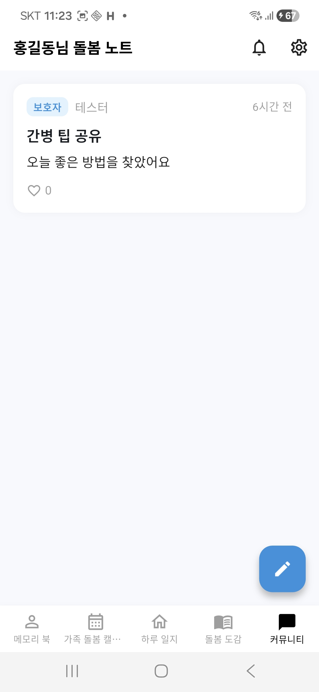
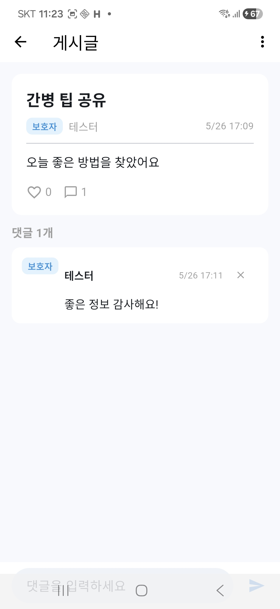

### 💬 실시간 채팅
- WebSocket(STOMP) 기반 1:1 실시간 채팅 — 보호자와 간병인의 직접 소통 채널
- 텍스트·이미지·파일 전송, 읽음 처리, 안 읽은 메시지 수 실시간 알림(`/user/queue/notifications`) + FCM 푸시

### 👤 회원 / 인증 / 관리자
- 이메일 회원가입 + **소셜 로그인 3종(Google·Kakao·Line)** + 온보딩
- JWT 인증 (액세스 30분 / 리프레시 14일, **Token Rotation**)
- 역할: 보호자(`PROTECTOR`) / 간병인(`CAREGIVER`) / 의료진(`MEDICAL_STAFF`)
- 관리자: 서비스 통계, 회원·게시글 관리, 신고 처리(기각)

---

## 🛠 기술 스택

| 구분 | 기술 |
|------|------|
| **Language / Framework** | Java 21, Spring Boot 3.5.0 |
| **Security** | Spring Security, JWT (JJWT 0.13.0), OAuth 소셜 로그인 (Google·Kakao·Line) |
| **Persistence** | Spring Data JPA, MySQL 8, HikariCP |
| **AI / RAG** | Spring AI 1.0.0, OpenAI (gpt-4o-mini, text-embedding-3-small) |
| **Vector Store** | PostgreSQL 16 + pgvector 0.8.0 |
| **Realtime** | WebSocket (STOMP) |
| **Push** | Firebase Cloud Messaging (FCM) |
| **Storage** | AWS S3 |
| **Cache / Async** | Spring Cache, `@Async` |
| **Mapping / Util** | Lombok, MapStruct |
| **API Docs** | springdoc-openapi 2.8.8 (Swagger UI) |
| **Build** | Maven |

---

## 🏗 시스템 아키텍처

<div align="center">
  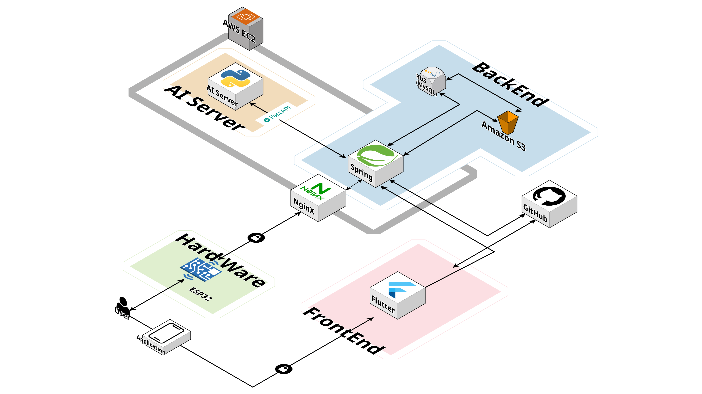
</div>

### 백엔드 내부 구성

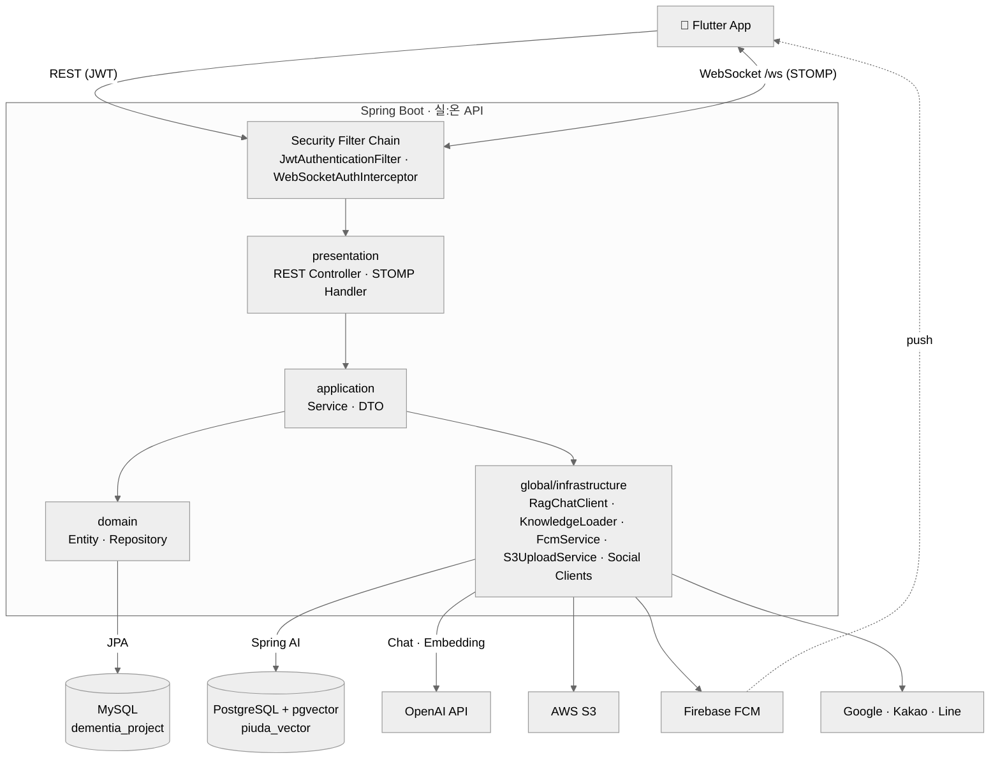

### RAG 파이프라인 (AI 케어 어드바이스)

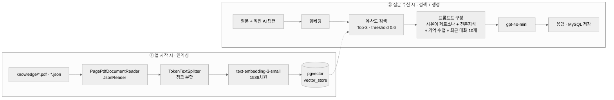

- `knowledge.reload-on-startup=false`(기본): `vector_store`가 비어 있을 때만 인덱싱 → 재시작 시 임베딩 비용 절감
- `knowledge.pdf-start-page=5`: 매뉴얼 표지·목차 페이지 제외 (5페이지 미만 PDF는 전체 읽기)

---

## 🔍 주요 설계 포인트

| 주제 | 설계 | 이유 |
|------|------|------|
| **데이터소스 이원화** | 운영 데이터는 MySQL(JPA), 벡터는 PostgreSQL·pgvector. `VectorStoreConfig`에서 PG DataSource를 **빈으로 노출하지 않고** 수동 구성 | JPA 자동 구성과의 DataSource 충돌 방지, 저장소 특성별 분리 |
| **도메인형 계층 구조** | 모든 도메인이 `presentation → application → domain` 3계층을 동일하게 가짐 | 도메인 추가·제거 시 영향 범위를 패키지 단위로 한정 |
| **N+1 완화** | `hibernate.default_batch_fetch_size=100` | 지연로딩 연관 엔티티를 IN 쿼리로 묶어 조회 |
| **커넥션 점유 최소화** | `spring.jpa.open-in-view=false`, 응답 DTO는 트랜잭션 내 생성 | 외부 API(OpenAI 등) 대기 중 DB 커넥션 반환 |
| **비동기 푸시** | `FcmService`에 `@Async` | FCM 지연·실패가 API 응답 시간에 영향 주지 않도록 분리 |
| **랭킹 캐싱** | 내공점수 랭킹 `@Cacheable` + `score DESC` 인덱스 | 조회 빈도가 높은 랭킹의 반복 정렬 비용 절감 |
| **토큰 보안** | 액세스 30분 / 리프레시 14일, 재발급 시 **Token Rotation**, 사용자당 리프레시 토큰 1개 | 탈취된 리프레시 토큰의 재사용 창 최소화 |
| **WebSocket 인가** | STOMP CONNECT 시 `WebSocketAuthInterceptor`에서 JWT 검증 | HTTP 필터를 거치지 않는 WebSocket 채널도 동일한 인증 적용 |
| **권한 검증** | 판단 기록 작성은 `CAREGIVER`만, 환자 리소스는 `PatientMember` 소속 여부 검증 | 같은 환자 그룹 외부에서의 접근 차단 |
| **커뮤니티 자정 작용** | 신고 누적 임계값(5/10) 기반 자동 숨김·삭제 | 운영자 개입 전에도 유해 게시물 노출 최소화 |

---

## 🗂 데이터베이스 스키마 (ERD)

<div align="center">
  <a href="docs/images/erd.png">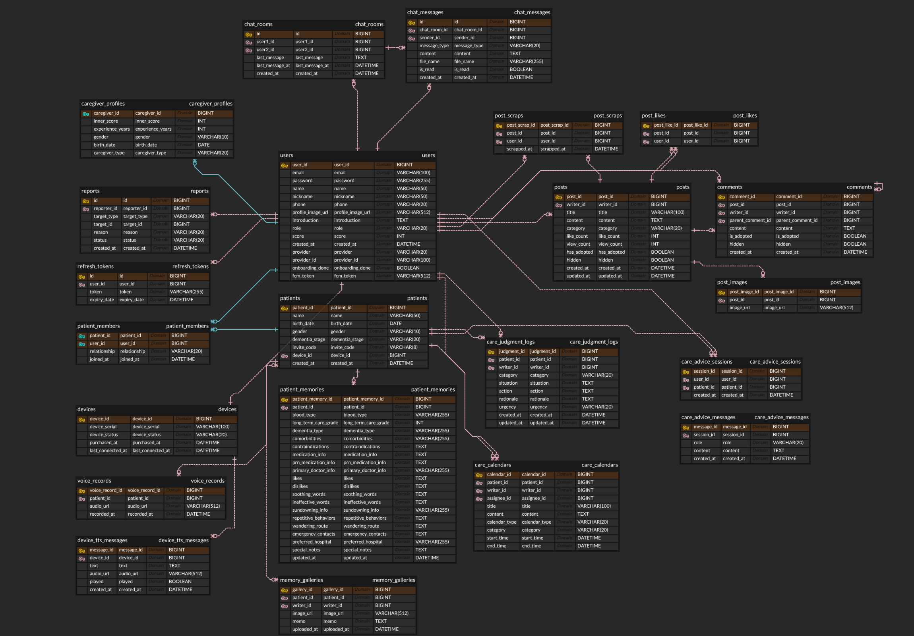</a>
  <br/><sub>클릭하면 원본 크기로 볼 수 있습니다. (<code>devices</code> · <code>voice_records</code> · <code>device_tts_messages</code>는 IoT 스피커 기획 단계의 테이블로, 현재 코드에서는 제거되었습니다.)</sub>
</div>

### 도메인 관계 요약 (Mermaid)


- **MySQL** (`dementia_project`): 회원·환자·판단기록·커뮤니티·채팅 등 운영 데이터
- **PostgreSQL** (`piuda_vector`): `vector_store` — RAG 지식 임베딩

주요 관계
- `users` ⇄ `patients` : **N:M** (중간 테이블 `patient_members` — 보호자·간병인 공동 돌봄)
- `patients` 1 : N `care_judgment_logs` / `care_calendars` / `memory_galleries` / `care_advice_sessions`
- `posts` 1 : N `comments` / `post_images`, `users` 1 : N `posts`

---

## 🔌 API 개요

> 전체 명세는 실행 후 Swagger UI(`http://localhost:8080/swagger-ui.html`)에서 확인할 수 있습니다.

| 도메인 | Base Path | 주요 엔드포인트 |
|--------|-----------|-----------------|
| 회원 | `/api/v1/users` | `POST /signup` · `POST /login` · `POST /refresh` · `POST /logout` · `POST /onboarding` · `GET·PUT·DELETE /me` · `GET /check-nickname` · `GET /ranking` · `PUT /fcm-token` · `GET /{nickname}/profile` |
| 소셜 로그인 | `/api/v1/auth` | `POST /google` · `POST /kakao` · `POST /line` |
| 환자 | `/api/v1/patients` | `POST /` · `POST /join` (초대코드) · `GET /my` · `GET·PUT·DELETE /{patientId}` |
| 기억 수첩 | `/api/v1/patients/{patientId}/patient-memory` | `GET` · `PUT` |
| 케어 판단 기록 | `/api/v1/patients/{patientId}/care-judgments` | `POST` · `GET` · `GET·PUT·DELETE /{logId}` |
| 캘린더 | `/api/v1` | `POST·GET /patients/{patientId}/calendars` · `GET·PUT·DELETE /calendars/{calendarId}` |
| 기억 갤러리 | `/api/v1/patients/{patientId}/gallery` | `POST /photos` (multipart) · `GET /photos` · `DELETE /photos/{galleryId}` |
| AI 케어 상담 | `/api/v1` | `POST·GET /patients/{patientId}/care-advice/sessions` · `POST·GET /care-advice/sessions/{sessionId}/messages` · `DELETE /care-advice/sessions/{sessionId}` |
| 게시글 | `/api/v1/posts` | `POST` (multipart) · `GET` · `GET·PUT·DELETE /{postId}` · `POST /{postId}/likes` · `POST·DELETE /{postId}/scraps` · `GET /scraps` |
| 댓글 | `/api/v1` | `POST·GET /posts/{postId}/comments` · `PUT·DELETE /comments/{commentId}` · `POST·DELETE /posts/{postId}/comments/{commentId}/adopt` |
| 신고 | `/api/v1` | `POST /posts/{postId}/reports` · `POST /comments/{commentId}/reports` |
| 채팅 | `/api/v1/chats` | `POST` · `GET` · `GET /{roomId}/messages` · `POST /{roomId}/files` · `PATCH /{roomId}/read` · `DELETE /{roomId}` |
| 채팅 (STOMP) | `/ws` | 발행 `/app/chat/{roomId}` · 구독 `/topic`, `/queue` |
| 관리자 | `/api/v1/admin` | `GET /stats` · `GET /users` · `DELETE /users/{userId}` · `GET /posts` · `DELETE /posts/{postId}` · `GET /reports` · `PATCH /reports/{reportId}/dismiss` |

### 인증
- 대부분의 엔드포인트는 `Authorization: Bearer <accessToken>` 헤더 필요
- 인증 불필요: 회원가입 / 로그인 / 토큰 재발급 / 닉네임 중복확인, 소셜 로그인, 게시글·댓글 조회
- JWT 클레임: `userId`, `email`, `role`

---

## 📁 프로젝트 구조

```
project.piuda
├── PiudaApplication.java        # @EnableCaching · @EnableAsync
├── domain/                      # 도메인별 패키지 (각 도메인 = 3계층)
│   ├── user/                    # 회원 · 인증(JWT) · 랭킹
│   ├── auth/                    # 소셜 로그인 (Google·Kakao·Line)
│   ├── patient/                 # 환자 등록 · 초대코드 합류
│   ├── patientmemory/           # 기억 수첩 (환자 신상 · 의료 정보)
│   ├── calendar/                # 가족 돌봄 캘린더
│   ├── carejudgment/            # ⭐ 케어 판단 기록
│   ├── careadvice/              # AI 케어 어드바이스 (시온이 · RAG)
│   ├── memorygallery/           # 기억 갤러리 (사진)
│   ├── community/               # 게시글 · 댓글 · 좋아요 · 스크랩 · 채택
│   ├── chat/                    # 1:1 실시간 채팅
│   ├── report/                  # 신고 · 자동 숨김/삭제
│   └── admin/                   # 관리자 통계 · 관리
│       ├── presentation/        #   Controller (HTTP 요청 처리)
│       ├── application/         #   Service + dto (비즈니스 로직)
│       └── domain/              #   Entity + Repository (영속성)
└── global/                      # 전 도메인 공통 인프라
    ├── security/                # JWT 필터 · Spring Security · WebSocket 인가
    ├── config/                  # VectorStore · WebSocket · S3 · Swagger · RestTemplate
    ├── infrastructure/          # S3 · FCM · RAG · 소셜 클라이언트 · 지식 로더
    └── exception/               # 전역 예외 처리
```

---

## 🚀 로컬 실행 방법

### 사전 요구사항
- **JDK 21**
- **MySQL 8** 로컬 3306 포트, `dementia_project` 스키마 생성
- **PostgreSQL 16** 로컬 5432 포트, `piuda_vector` 스키마 + `vector` 확장 활성화

```sql
-- PostgreSQL
CREATE DATABASE piuda_vector;
\c piuda_vector
CREATE EXTENSION IF NOT EXISTS vector;
```

### 환경변수 (IDE Run Configuration 또는 셸)
```bash
JWT_SECRET=...                       # HS256용 시크릿 (32바이트 이상 권장)
MYSQL_PASSWORD=...
PGVECTOR_PASSWORD=...
OPENAI_API_KEY=...
AWS_ACCESS_KEY=...
AWS_SECRET_KEY=...
GOOGLE_CLIENT_ID=...
LINE_CLIENT_ID=...
FCM_SERVICE_ACCOUNT_KEY_PATH=...     # (선택) 없으면 푸시 비활성화
```

### 빌드 & 실행
```bash
# 빌드
./mvnw clean package -DskipTests

# 로컬 실행
./mvnw spring-boot:run

# 전체 테스트
./mvnw test
```

### 지식 베이스 준비 (RAG)
- `src/main/resources/knowledge/`에 치매 케어 매뉴얼 PDF 또는 JSON을 배치합니다. (`.gitignore` 처리되어 환경마다 직접 배치 필요)
- JSON 형식: `[{"title": "...", "content": "..."}]` — `content` 필드가 벡터화됩니다.
- 지식 파일을 교체했다면 `TRUNCATE vector_store` 후 `knowledge.reload-on-startup=true`로 한 번 실행합니다.

---

## 📈 기대 효과 & 사업화

### 단계별 기대 효과

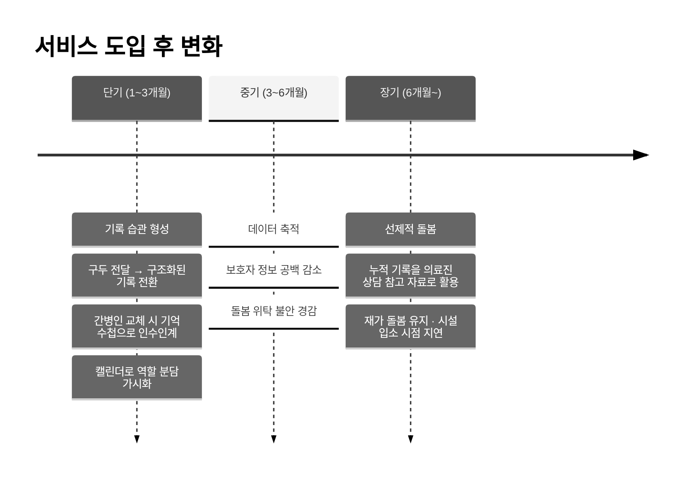

| 단계 | 성과 지표 | 측정 방법 | 목표 |
|------|-----------|-----------|------|
| 단기 | 주간 기록 완료율 | 앱 내 기록 횟수 집계 | 주 5일 이상 |
| 단기 | 캘린더 등록 구성원 수 | 돌봄 그룹 구성 현황 | 가구당 평균 2인 이상 |
| 중기 | 보호자 부양부담 척도(ZBI) | 표준화 설문 (ZBI 22문항) | 개입 전 대비 유의미한 감소 |
| 장기 | 의료진 상담 활용률 | 이용자 설문 | 장기 이용자 중 50% 이상 |

### 주체별 기대 효과

| 주체 | 단기 | 중기 | 장기 |
|------|------|------|------|
| 보호자 | 돌봄 현황 확인, 정보 공백 해소 | 심리적 부담·불안 감소 | 데이터 기반 의료 상담 |
| 간병인 | 기록 부담 감소, 인수인계 효율화 | 판단 이력 축적 → 전문성 입증 | 경력 데이터 보유 |
| 가족 구성원 | 역할 분담 가시화 | 독박 돌봄 구조 해소, 원거리 참여 | 지속 가능한 공동 돌봄 |
| 환자 | 일관된 돌봄 경험 | 생애 기억 기록 시작 | 존엄성 중심 돌봄 실현 |
| 의료진 | — | 구조화된 생활 기록 수신 | 객관적 상태 판단 보조 |

### 사업화 전략

| 단계 | 모델 |
|------|------|
| 단기 | 보호자 **구독형 프리미엄 플랜** — 무료(기본 기록·가족 공유·알림) / 프리미엄(AI 리포트·장기 데이터 저장·상세 분석) |
| 중기 | 지자체 · 치매안심센터 대상 **SaaS 공급** |
| 장기 | 축적된 돌봄 데이터 기반 의료·보험사 연계 (**익명화 전제**) |
| 경쟁 우위 | 공식 매뉴얼 RAG로 확보한 신뢰성, 누적된 커뮤니티 신뢰 네트워크 |
| 확장성 | 치매 → 노인 돌봄 전반 → 장애인 돌봄으로 버티컬 확장 |

### 로드맵 (기획 단계 확장 기능)
- [ ] **보호자 안심 리포트** — 누적 기록을 LLM으로 주간·월간 요약
- [ ] **복지 정보 제공** — 장기요양등급 신청·재가급여 등 제도 안내
- [ ] 시온이 응답 후 **치매안심센터 연결 / 커뮤니티 질문하기** 연계
- [ ] IoT 스피커 기반 환자 일상 대화 기록 (ESP32 · STT)

---

## 🤝 팀 소개

**팀 피오리라** — 2026 글로벌 피우다프로젝트

| 이름 | 역할 |
|------|------|
| 최동현 (팀장) | 전체 파이프라인 구축 · **백엔드 개발** · 프론트엔드 개발 · 인프라 관리 |
| 송효정 | 치매 특화 AI 챗봇 개발 · 프론트엔드 개발 |
| 이주은 | 하드웨어 회로 설계 · 펌웨어 및 파이프라인 개발 |
| 김지영 | 서비스 기획 · UX/UI 설계 · 시장 분석 · 비즈니스 전략 |

---

<div align="center">

**실:온 (Sil:On)** · 소통 중심의 치매 돌봄 플랫폼

</div>
